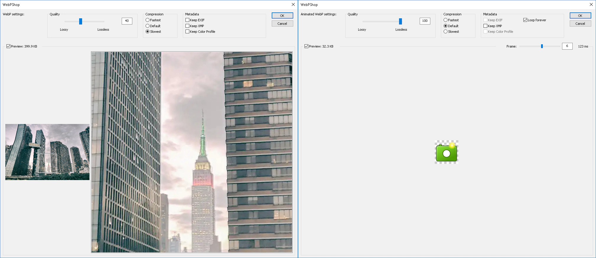

# WebP file format plug-in for Photoshop

Current plug-in version: WebPShop 0.3.2

WebPShop is a Photoshop module for opening and saving WebP images, including
animations.

Please look at the files LICENSE and CONTRIBUTING in the "docs" folder before
using the contents of this repository or contributing.

## Installation

Download the binary at https://github.com/webmproject/WebPShop/releases. \
Direct link for Windows x64:
https://github.com/webmproject/WebPShop/releases/download/v0.3.2/WebPShop_0_3_2_Win_x64.8bi \
Direct link for MacOS (extract the ZIP archive afterwise):
https://github.com/webmproject/WebPShop/releases/download/v0.3.2/WebPShop_0_3_2_Mac_x64.zip \
Move the plug-in (the .8bi binary for Windows or the .plugin folder for MacOS)
to the Photoshop plug-in directory
(`C:\Program Files\Adobe\Adobe Photoshop\Plug-ins\` for Windows x64,
`Applications/Adobe Photoshop/Plug-ins/` for Mac). Run Photoshop.

On macOS 10.15+, the prompt "WebPShop.plugin cannot be opened because
the developer cannot be verified" can be bypassed by running the following
in Terminal (Finder > Applications > Utilities):

```
sudo xattr -r -d com.apple.quarantine /Applications/Adobe\ Photoshop\ 2020/Plug-ins/WebPShop.plugin
```

## Build

Current libwebp version: WebP 1.2.0

Use Microsoft Visual Studio (2017 and above) for Windows and XCode for Mac.

*   Download the latest Adobe Photoshop Plug-In and Connection SDK at
    https://console.adobe.io/downloads/ps,
*   Download the latest WebP binaries at
    https://developers.google.com/speed/webp/docs/precompiled or build them,
*   Put the contents of this repository in a "webpshop" folder located at
    `adobe_photoshop_sdk_[version]/pluginsdk/samplecode/format`,
*   Add `path/to/webp/includes` and `path/to/webp/includes/src` as Additional
    Include Directories to the WebPShop project [1],
*   Add webp, webpdemux, webpmux libraries as Additional Dependencies to the
    WebPShop project [1],
*   Build it with the same architecture as your Photoshop installation
    (x86 or x64 for Windows, x64 for Mac),
*   Build it with the same architecture and config as the WebP library binaries
    (x86 or x64 for Windows, x64 for Mac, Debug/Release),
*   By example for Windows, it should output the plug-in file `WebPShop.8bi` in
    `adobe_photoshop_sdk_[version]/pluginsdk/samplecode/Output/Win/Debug[64]/`.

[1] By default the XCode project includes and links to the
`libwebp-[version]-mac-[version]` folder in the `webpshop` directory. The VS
project expects `libwebp-[version]-windows-x64` (and/or `-x86`).

## Features

*   `Open`, `Open As` menu commands can be used to read .webp files.
*   `Save`, `Save As` menu commands can be used to write .webp files. Encoding
    parameters can be tuned through the UI.



## Encoding settings

For information, the quality slider maps the following ranges to their internal
WebP counterparts (see SetWebPConfig() in WebPShopEncodeUtils.cpp):

    | Quality slider value   -> | 0    ...    97 | 98         99 |    100   |
    |---------------------------|----------------|---------------|----------|
    | WebP encoding settings -> | Lossy, quality | Near-lossless | Lossless |
    |                           | 0    ...   100 | 60         80 |          |

The radio buttons offer several levels of compression effort:

    | Label   | WebP speed setting  | Sharp YUV    | WebP "quality" setting |
    |         |                     | (lossy only) | (except for lossy)     |
    |---------|---------------------|--------------|------------------------|
    | Fastest |          1          |      No      |            0           |
    | Default |          4          |      No      |           75           |
    | Slowest |          6          |      Yes     |          100           |

## Limitations

*   Only English is currently supported.
*   Only "RGB Color" image mode at "8 Bits/Channel" is currently supported.
*   WebP images cannot exceed 16383 x 16383 pixels.
*   The Timeline data is not used; thus animations rely on layers for defining
    frames (set duration as "(123 ms)" in each layer's name), and they need to
    be rasterized before saving.
*   On some images, lossless compression might produce smaller file sizes than
    lossy. That's why the quality slider is not linear. The same problem exists
    with the radio buttons controlling the compression effort.
*   This plug-in does not extend `Export As` neither `Save for Web`.
*   Encoding and decoding are done in a single pass. It is not currently
    possible to cancel such actions, and it might take some time on big images.
*   Only the latest Photoshop release is supported.

## Troubleshooting

If the plug-in is not detected or does not behave as expected, the steps below
might help:

*   Update Photoshop to the latest version.
*   Double-check that the plug-in binaries match the Operating System and the
    architecture.
*   The plug-in should be listed in the "Help > About Plug-In" submenu if it is
    found by Photoshop.
*   If it is undetected, disable any antivirus program or allow the plug-in
    execution (including in MacOS and Windows built-in protections).
*   If it is still undetected, try each of these folders (Windows paths):

        C:\Program Files\Common Files\Adobe\Plug-Ins\CC
        C:\Program Files\Common Files\Adobe\Plug-Ins\CC\File Formats
        C:\Program Files\Adobe\Adobe Photoshop 2020\Plug-ins

*   If it is still undetected, remove all plug-ins from all folders and copy
    WebPShop in only one of these folders, in case there is a plug-in conflict.
    Restart the computer and/or Photoshop.
*   If it is detected but there is no WebP entry in the Save menu, check that
    WebP files can be at least opened (find one online such as this one:
    https://www.gstatic.com/webp/gallery/4.sm.webp). The issue might come from
    unsupported encoding settings, see the limitations above.

If the issue still occurs, please file a bug at
https://github.com/webmproject/WebPShop/issues

## Software architecture

The `common` folder contains the following:

*   `WebPShop.h` is the main header, containing most functions.
*   `WebPShop.cpp` contains the plug-in entry point (called by host).
*   `WebPShop.r` and `WebPShopTerminology.h` represent the plug-in properties.
*   Functions in `WebPShopSelector*` are called in `WebPShop.cpp`.
*   `WebPShop*Utils.cpp` are helper functions.
*   `WebPShopScripting.cpp` is mostly used for automation.
*   `WebPShopUI*` display the encoding parameters window and the About box.

The `win` folder contains a Visual Studio solution and project, alongside with
`WebPShop.rc` which is the encoding parameters window layout and About box.

The `mac` folder contains an XCode project. `WebPShopUIDialog_mac.h` and `.mm`
describe the UI layout, while `WebPShopUI_mac.mm` handles the window events.
